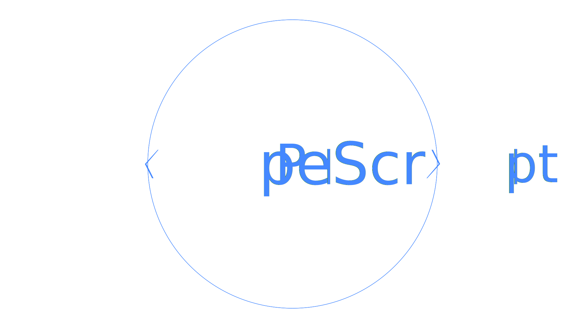

<div align='center'>

</div>

# What Is PipeScript?

PipeScript is a new programming language built atop PowerShell.

It is designed to make programming more scriptable and scripting more programmable.

PipeScript is transpiled into PowerShell.

PipeScript can be run interactively, or used to build more PowerShell with less code.

PipeScript can also be embedded in many other languages to dynamically generate source code.

If you like PipeScript, why not use it to star this repository?:

~~~PowerShell
# Install PipeScript
Install-Module PipeScript -Scope CurrentUser
# Import PipeScript
Import-Module  PipeScript -Force

# Then use Invoke-PipeScript to run
Invoke-PipeScript -ScriptBlock {    
    param([Parameter(Mandatory)]$gitHubPat)
    # Using PipeScript, you can use URLs as commands, so we just need to call the REST api
    put https://api.github.com/user/starred/StartAutomating/PipeScript -Headers @{
        Authorization="token $gitHubPat"
    }
} -Parameter @{GitHubPat = $YourGitHubPat}
~~~ 

## Making Scripting more Programmable

Interpreted languages often lack a key component required for reliability:  a compiler.

PipeScript allows you to build PowerShell scripts, and provides you with an engine to change any part of your code dynamically.

This allows us to fine-tune the way we build PowerShell and lets us extend the language to make complex scenarios simple.

See the [List of Transpilers](ListOfTranspilers.md) you can use to transform your scripts.

## Making Programming more Scriptable

Programming is tedious, not hard.

Often, programming involves implementing small functional changes within a specific templatable scenario.

For example, if implementing an interface or subclass, the only things that will change are the class name and method details.

PipeScript can be be embedded within 39 languages.

Embedding PipeScript within any of these languages allows you to generate any of these languages with parameterized scripts, thus removing some of the tedium of programming.

See the [Supported Languages](SupportedLanguages.md) you can use to transform your scripts.

## What's a Transpiler?

A transpiler takes source code written in one language and transforms or translates it.

Transpilers can be used to extend a given language.
For example, TypeScript adds strongly typed features to JavaScript, a weakly typed language.

Transpilers can also be used to convert from one language to another.
For example, most PowerShell ```Select-Object``` statements could be translated to SQL.

Transpilers can also be used to optimize or reconfigure source code.
For example, any minifier or code stylization tool is a transpiler. 

## What makes PipeScript unique?

PipeScript is unique because PowerShell is unique.

There are a few facets of PowerShell's uniqueness that make PipeScript possible:

### Incredibly Flexible Syntax

One of PowerShell's strengths is it's consistent syntax.  Most PowerShell you encounter will be cleanly organized into Verbs and Nouns.
For example, ```Get-Process```.

However, like JavaScript, what is valid syntax goes far beyond what PowerShell uses.  Commands can be named almost anything.  Attributes and Types need not exist to be valid.  This gives us many places we can extend PowerShell as a language.

Additionally, the core language features of PowerShell are a superset of most programming languages.  This means that PowerShell should be able to be transpiled into any language.

### The Abstract Syntax Tree

PowerShell also has an Abstract Syntax Tree.  This is used to represent scripts before they run.  As the name implies, this is hierarchical representation of syntax, which lets us walk thru step-by-step, not just token-by-token.

Because the Abstract Syntax Tree of PowerShell is so well-defined, it lets us be incredibly flexible.  Not only can we transform certain parts of the syntax, we can do so differently based off of the surrounding context.  This makes transforming PowerShell much more potent than a simple find and replace.

### Rich RegEx Support

PowerShell comes with Rich RegEx Support.
The ```-match```, ```-replace```, and ```-split``` operators help slice and dice text, and the .NET ```[RegEx]``` class allows for even more advanced operations.  This lets us flexibly parse text and turn it into objects.

### The Object Pipeline

The Object Pipeline is the backbone of PowerShell and PipeScript.

It allows you to pipe structured data, not text, from one step to the next.

By using the object pipeline, you loosely couple each step and allow steps to easily take input from structured files or APIs.

PipeScript allows you to transpile using an Object Pipeline.
