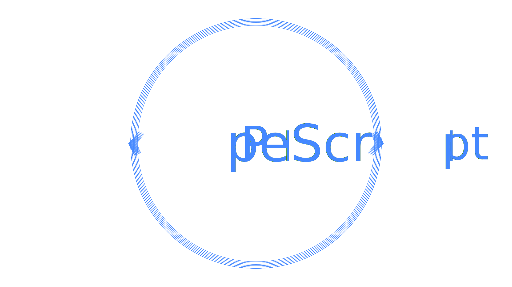

# What Is PipeScript?

PipeScript is a metaprogramming language built in PowerShell.

It lets you compile PowerShell and easily work with 65 other languages (and counting).

It is designed to make programming more scriptable and scripting more programmable.

PipeScript can be run interactively, or used to build more with less code.

PipeScript can be used to template 65 languages, and implicitly interpert 16 languages.

## Implicit Interpretation

Any Language can define an .Interpeter, and PipeScript can use this information to implicitly interpret other languages.

For example, if you have PipeScript and NodeJS installed, you can:

~~~PowerShell
.\RunAJavaScriptFile.js "With Arguments!"
~~~

## Making Scripting more Programmable

Interpreted languages often lack a key component required for reliability:  a compiler.

PipeScript allows you to build PowerShell scripts, and provides you with an engine to change any part of your code dynamically.

This allows us to fine-tune the way we build PowerShell and lets us [extend the language](PipeScriptSyntax.md) to make complex scenarios simple.

See the [List of Transpilers](ListOfTranspilers.md) you can use to transform your scripts.

## Making Programming more Scriptable

Programming is tedious, not hard.

Often, programming involves implementing small functional changes within a specific templatable scenario.

For example, if implementing an interface or subclass, the only things that will change are the class name and method details.

PipeScript can work with 65 languages.

Embedding PipeScript within any of these languages allows you to generate any of these languages with parameterized scripts, thus removing some of the tedium of programming.

See the [Supported Languages](SupportedLanguages.md) you can use to transform your scripts.

## Like It?  Star It!

If you like PipeScript, why not use it to star this repository?:

~~~PowerShell
# Install PipeScript
Install-Module PipeScript -Scope CurrentUser
# Import PipeScript
Import-Module  PipeScript -Force

# Then use Invoke-PipeScript to run
Invoke-PipeScript -ScriptBlock {
    param([Parameter(Mandatory)]$gitHubPat)
    # Using PipeScript, you can use URLs as commands, so we just need to call the REST api
    put https://api.github.com/user/starred/StartAutomating/PipeScript -Headers @{
        Authorization="token $gitHubPat"
    }
} -Parameter @{GitHubPat = $YourGitHubPat}
~~~
